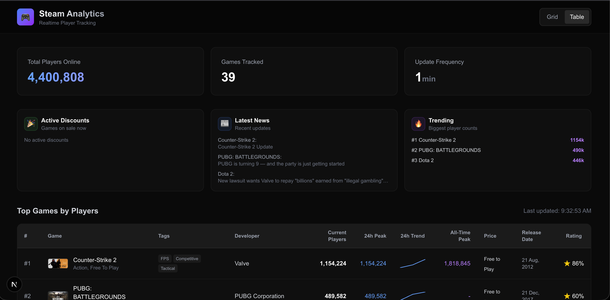
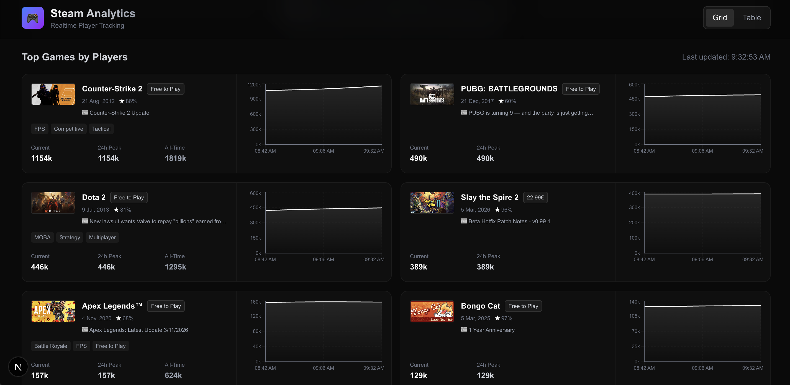
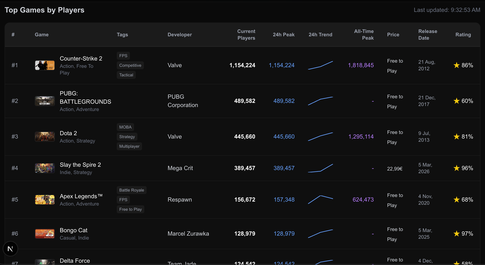
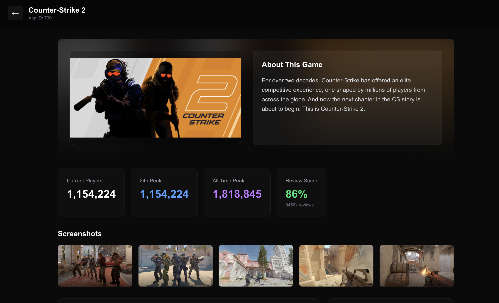
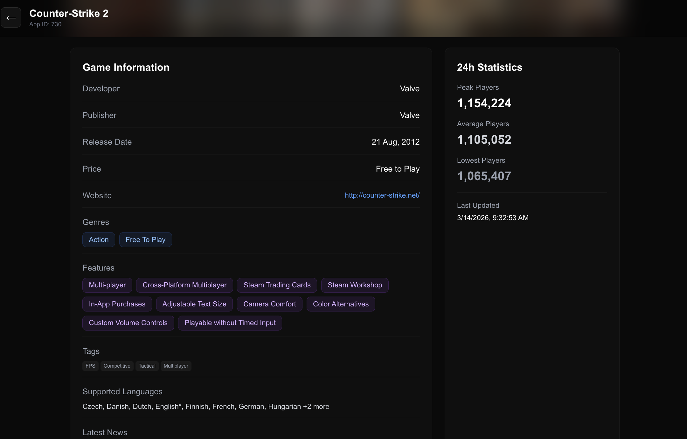

# 🎮 Steam Analytics Dashboard

A real-time Steam player tracking dashboard built with Next.js, Convex, and the Steam Web API. Track player counts, view historical trends, and explore comprehensive game data for the top 100 games on Steam.



## ✨ Features

### 📊 Real-Time Player Tracking
- **Live Updates**: Automatic player count updates every 30 minutes via Convex cron jobs
- **Top 100 Games**: Dynamically fetched from Steam Charts API, ranked by concurrent players
- **Historical Data**: Minute-by-minute player count tracking with 24-hour history

### 🎯 Dual View Modes
- **Grid View**: Compact cards with inline mini charts (20 games)
- **Table View**: Comprehensive spreadsheet-style view with sparkline charts (100 games)

### 📈 Rich Game Data
- Current player counts with real-time updates
- 24-hour peak and all-time peak statistics
- Mini sparkline charts showing 24h player trends
- Game metadata: developers, publishers, genres, categories
- Pricing information with discount badges
- Review scores and Metacritic ratings
- Release dates and supported languages
- Latest news from Steam News API
- Game screenshots and descriptions

### 🎨 Beautiful UI
- Dark, modern design with glass-morphism effects
- Blurred background hero sections
- Color-coded statistics (current, 24h peak, all-time peak)
- Responsive layout optimized for all screen sizes
- Smooth transitions and hover effects

### 🔍 Detailed Game Pages
- Comprehensive game information pages
- Full player count history charts
- Screenshot galleries
- Developer and publisher information
- Genre and category tags
- Official website links
- Latest news updates

## 🛠️ Tech Stack

- **Frontend**: [Next.js 16](https://nextjs.org/) with App Router
- **Backend**: [Convex](https://www.convex.dev/) - Real-time database with serverless functions
- **Styling**: [Tailwind CSS](https://tailwindcss.com/)
- **Charts**: [Recharts](https://recharts.org/) + Custom SVG Sparklines
- **Data Source**: [Steam Web API](https://steamcommunity.com/dev)
  - `ISteamChartsService/GetGamesByConcurrentPlayers` - Top games ranking
  - `ISteamUserStats/GetNumberOfCurrentPlayers` - Live player counts
  - `ISteamNews/GetNewsForApp` - Latest game news
  - Steam Store API - Game metadata and details

## 📸 Screenshots

### Dashboard Overview

*Main dashboard showing total players online, games tracked, update frequency, active discounts, latest news, and trending games with the table view of top games*

### Grid View

*Compact card layout with game thumbnails, inline charts showing 24-hour player trends, and key statistics for each game*

### Table View

*Comprehensive table displaying 100 games with sparkline charts, developer info, pricing, ratings, and detailed player statistics*

### Game Detail Page - Overview

*Detailed game page with blurred background, game description, current/peak/all-time player statistics, review scores, and screenshot gallery*

### Game Detail Page - Information

*Game information section showing developer, publisher, release date, pricing, genres, features, tags, and supported languages*

## 🚀 Getting Started

### Prerequisites

- Node.js 18+ installed
- A Convex account (free tier available at [convex.dev](https://www.convex.dev/))
- Steam Web API access token (see setup instructions below)

### Installation

1. **Clone the repository**
   ```bash
   git clone https://github.com/eBurial/steam-analytics-convex.git
   cd steam-analytics-convex
   ```

2. **Install dependencies**
   ```bash
   npm install
   ```

3. **Set up Convex**
   ```bash
   npx convex dev
   ```
   This will:
   - Create a new Convex project (or link to existing)
   - Set up the database schema
   - Deploy serverless functions

4. **Configure Steam API Access Token**
   
   You need a Steam access token to fetch top games from the Charts API:
   
   ```bash
   npx convex env set STEAM_ACCESS_TOKEN "your_steam_access_token_here"
   ```
   
   **How to get a Steam access token:**
   - Log into Steam in your browser
   - Open Developer Tools (F12)
   - Go to Application/Storage → Cookies
   - Find the `steamLoginSecure` cookie or extract the JWT token from network requests
   - The token format is: `eyAidHlwIjogIkpXVCIsIC...`

5. **Run the development server**
   ```bash
   npm run dev
   ```

6. **Open the app**
   
   Navigate to [http://localhost:3000](http://localhost:3000)

## 📁 Project Structure

```
my-app/
├── app/
│   ├── game/[appId]/
│   │   └── page.tsx          # Game detail page
│   ├── GameChart.tsx          # Full-size player count chart
│   ├── MiniSparkline.tsx      # Compact sparkline component
│   ├── page.tsx               # Main dashboard
│   └── layout.tsx             # Root layout
├── convex/
│   ├── schema.ts              # Database schema
│   ├── steam.ts               # Queries and mutations
│   ├── fetchSteamData.ts      # Steam API integration
│   └── crons.ts               # Scheduled jobs
└── public/
    └── screenshots/           # App screenshots
```

## 🔄 How It Works

1. **Data Collection**: A Convex cron job runs every 30 minutes to:
   - Fetch top 100 games from Steam Charts API
   - Get current player counts for each game
   - Fetch game metadata from Steam Store API
   - Store player counts in historical database

2. **Real-Time Updates**: Convex provides real-time subscriptions, so the UI updates automatically when new data arrives

3. **Player History**: Every data point is stored with a timestamp, allowing for:
   - 24-hour trend charts
   - Peak player calculations
   - Historical analysis

4. **Dynamic Ranking**: Games are automatically ranked by current player count, ensuring the dashboard always shows the most popular games

## 🎨 Features Breakdown

### Grid View
- 20 most popular games
- Compact cards with game thumbnails
- Inline mini charts (280px width)
- Quick stats: current, 24h peak, all-time peak
- Tags, pricing, and discount badges
- Click to view detailed page

### Table View
- 100 most popular games
- Sortable columns (coming soon)
- Mini sparkline charts (60×20px)
- Comprehensive data in spreadsheet format
- Clickable rows for game details

### Game Detail Page
- Blurred background using game header image
- Full-size player count chart
- Screenshot gallery (5 images)
- Complete game information
- Developer, publisher, genres, categories
- Pricing with discount information
- Review scores and Metacritic ratings
- Latest news updates
- Supported languages

## 🔧 Configuration

### Cron Job Frequency

Edit `convex/crons.ts` to change update frequency:

```typescript
crons.interval(
  "fetch steam player counts",
  { minutes: 30 }, // Change this value
  internal.fetchSteamData.fetchAndUpdate
);
```

### Number of Games

Edit `app/page.tsx` to change game limits:

```typescript
const games = useQuery(api.steam.getTopGames, { 
  limit: viewMode === 'table' ? 100 : 20 // Adjust these numbers
});
```

## 📊 Database Schema

### Games Table
- `appId`: Steam App ID
- `name`: Game name
- `currentPlayers`: Current player count
- `peakPlayers24h`: Peak in last 24 hours
- `allTimePeak`: Historical peak
- `price`, `originalPrice`, `discountPercent`
- `developers`, `publishers`, `genres`, `categories`
- `headerImage`, `screenshots`
- `reviewScore`, `reviewCount`, `metacriticScore`
- `releaseDate`, `website`, `supportedLanguages`
- `latestNews`, `newsDate`
- `tags`, `shortDescription`

### Player History Table
- `appId`: Steam App ID
- `playerCount`: Player count at timestamp
- `timestamp`: Unix timestamp

## 🤝 Contributing

Contributions are welcome! Please feel free to submit a Pull Request.

1. Fork the repository
2. Create your feature branch (`git checkout -b feature/AmazingFeature`)
3. Commit your changes (`git commit -m 'Add some AmazingFeature'`)
4. Push to the branch (`git push origin feature/AmazingFeature`)
5. Open a Pull Request

## 📝 License

This project is licensed under the MIT License - see the [LICENSE](LICENSE) file for details.

## 🙏 Acknowledgments

- [Steam Web API](https://steamcommunity.com/dev) for providing game data
- [Convex](https://www.convex.dev/) for the amazing real-time database
- [Recharts](https://recharts.org/) for beautiful charts
- [Tailwind CSS](https://tailwindcss.com/) for styling utilities

## 📧 Contact

Project Link: [https://github.com/eBurial/steam-analytics-convex](https://github.com/eBurial/steam-analytics-convex)

---

⭐ Star this repo if you find it useful!
